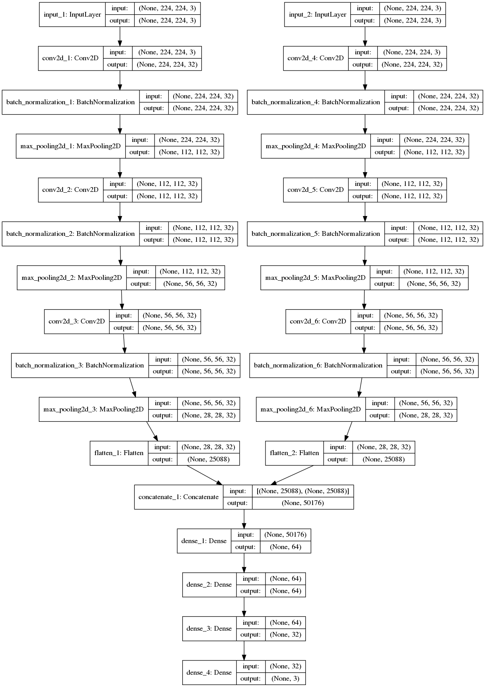

# EcoClassifier using top and side cameras

Classification of different types of plastic.
This time, instead of only taking top view, we also use the side view.
We feed both those inputs into a custom dual input/ dual VGG16 neural network, and we hope to get better results.

## Prepare the data

We need to use the info in the .json to group the images of the same object, which means they were taken approximately at the same time.

All of this process is done in the dataset_2input.ipynb jupyter notebook.

At the end of it, you will have different .csv.

The cam1.csv and cam2.csv can be used to only train on top or side view.
The pair_only_info.csv is the one that we will use, as it gives the info of the images that could have been grouped.

# Train the NN

The NN that is built looks like that:

To build and train this network, you can use the classifier_vgg_2input.ipynb jupyter.

# Performances

Not did a deep analysis of the results, but they were pretty much the same as with the 1-input/ top view classifier.

Maybe with more data ??
